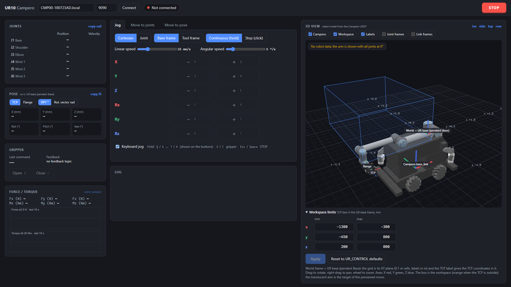
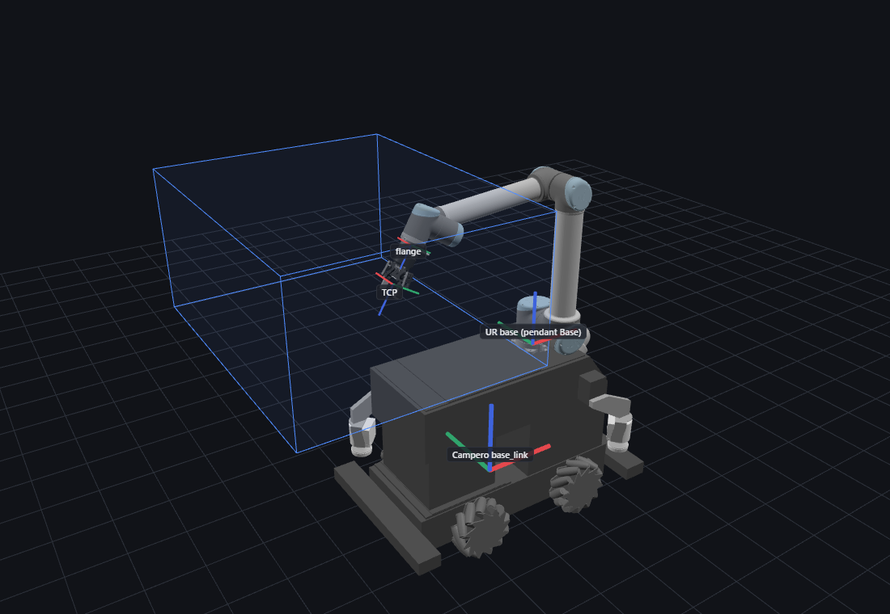

# UR10 Control – Python interface for the Campero

Python tools to drive the **UR10 arm of the Robotnik Campero** from a remote PC
(Windows or Linux) over Wi‑Fi. The remote PC talks to the ROS workspace running
on the Campero through **rosbridge** (websocket). All robot messages are built
by one class, `UR10Control` (`core/ur_control.py`).

On top of the framework there are:

- a **web control panel** (`webui/`): jog in joint or Cartesian space (velocity or
  step), move to joint or pose targets, open and close the gripper, and read joint
  states, TCP pose, gripper state and force/torque live, all from the browser. A
  **3D view** shows the Campero and the arm like RViz, built from the robot's URDF;
- a **Python API** (`ur10api/`) for your own control code: read joints, TCP pose,
  force/torque and gripper, and send position or velocity commands, with three
  example programs (`examples/`) and a [developer guide](docs/ur10api.md);
- the original **controllers**: terminal keyboard, 3Dconnexion SpaceMouse, Leap
  Motion hand gestures and force-guided motion.



---

## Contents

1. [How it works](#how-it-works)
2. [Repository layout](#repository-layout)
3. [Quick start (Windows and Linux)](#quick-start-windows-and-linux)
4. [Robot-side start-up (Campero PC)](#robot-side-start-up-campero-pc)
5. [Web control panel](#web-control-panel)
6. [Python API for your own control code](#python-api-for-your-own-control-code)
7. [Other controllers](#other-controllers)
8. [Framework reference](#framework-reference)
9. [Configuration](#configuration)
10. [Updating the robot model](#updating-the-robot-model)
11. [Safety](#safety)
12. [Troubleshooting](#troubleshooting)
13. [Credits](#credits)

---

## How it works

```
 Remote PC (Windows / Linux)                           Campero PC (ROS 1)
┌──────────────────────────────────┐   Wi-Fi         ┌──────────────────────────────────┐
│ webui/ or controllers/           │   websocket     │ rosbridge_websocket (port 9090)  │
│   └── UR10Control (core/)  ──────┼──── :9090 ─────►│   /pub_ik_trajectory ──► UR10    │
│         roslibpy                 │◄────────────────┼── /joint_states                  │
│                                  │                 │   /pub_gripper_control ► gripper │
│                                  │◄────────────────┼── /robotiq_ft_sensor             │
└──────────────────────────────────┘                 └──────────────────────────────────┘
```

On the Campero, `campero_ur10_bringup.launch` starts two small nodes
(`campero_robot_real_bring_up/scripts`). `pub_ik_trajectory.py` restamps every
`/pub_ik_trajectory` message and forwards it to the UR driver's
`/pos_joint_traj_controller/command`. `pub_gripper_cmd.py` turns
`/pub_gripper_control` into Robotiq commands on `/robotiq_2f_gripper/output`.
Every arm command is a `JointTrajectory` with a **single point**: six joint positions
and a `time_from_start`. The joint trajectory controller interpolates from the
current state to that point.

| ROS name | Type | Direction | Content |
|---|---|---|---|
| `/joint_states` | `sensor_msgs/JointState` | robot → PC | arm joint positions (the last 6 entries of the arrays) |
| `/pub_ik_trajectory` | `trajectory_msgs/JointTrajectory` | PC → robot | 1 point: joints `campero_ur10_*` + `time_from_start` |
| `/pub_gripper_control` | `trajectory_msgs/JointTrajectory` | PC → robot | `campero_robotiq_85_left_knuckle_joint`: `-0.99` open, `0.99` close, 0.4 s |
| `/robotiq_ft_sensor` | `robotiq_ft_sensor/ft_sensor` | robot → PC | `Fx Fy Fz` [N], `Mx My Mz` [Nm] (tool0 frame) |
| `/robotiq_ft_sensor_acc` (service) | `robotiq_ft_sensor/sensor_accesor` | PC → robot | `command_id: 8` = SET ZERO |
| `/clock` | `rosgraph_msgs/Clock` | robot → PC | time stamp copied into the command headers |
| `/robotiq_2f_gripper/input` | `robotiq_2f_gripper_control/Robotiq2FGripper_robot_input` | robot → PC | *optional*, read-only gripper feedback shown by the web panel |

`UR10Control.send_trajectory(target, speed)` accepts a 4×4 TCP pose (solved with
the analytic UR10 inverse kinematics) or, with `art=True`, six joint angles. The
trajectory duration is **largest joint displacement / `speed`**, so `speed` is
the average speed [rad/s] of the joint that moves the most.

### Frames, TCP and calibration



| Frame | Meaning |
|---|---|
| `campero_base_link` | Campero mobile base: x forward, z up |
| `campero_ur10_base` | **UR base**: the controller's *Base*, i.e. the pendant's Base and UR_CONTROL's base frame. It is 0.215 m forward and 0.5885 m above `campero_base_link`, with the same orientation (the URDF mounts `ur10_base_link` rotated 180° and `base` rotates it back) |
| `campero_ur10_tool0` | tool flange: what the pendant shows with an all-zero TCP |
| TCP | UR_CONTROL's tool point: flange + 150 mm along the flange Z axis (`tcp_offset` in `core/ur10_core.py`). The URDF puts the gripper tip (`gripper_aruco_link`) at 199 mm |

UR_CONTROL computes FK/IK with the **nominal** UR10 parameters. The controller,
the pendant and RViz use this arm's **factory calibration**
(`campero_ur10_calibration.yaml`, loaded into the URDF by the bring-up). The two
differ by **3–6 mm and up to 0.8°** at the flange. The web panel and `ur10api`
use the calibrated model (see [Web control panel](#web-control-panel)); the
original controllers keep the nominal one.

---

## Repository layout

```
core/                 framework
  ur_control.py         UR10Control: connection, subscriptions, commands
  ur10_core.py          FK/IK wrappers with the TCP offset, workspace limits
  kinematics_utils.py   analytic UR10 kinematics (DH parameters)
  conversions.py        pose / quaternion / RPY conversions
  plots.py, spacemouse.py, leap_gestures*.py, trajectory.py, ros_structs.py
controllers/          original controllers (keyboard, SpaceMouse, Leap Motion, force)
ur10api/              Python API for your own control code (docs/ur10api.md)
  robot.py              Robot: state, position/velocity commands, gripper, sensor, stop
  kinematics.py         calibrated FK/IK (ArmModel) and workspace box (Workspace)
  transforms.py         pose helpers (trans, rotz, displace, pose_error, ...)
  viz.py                FrameView: live 3D plot of the arm, frames and paths
examples/             ur10api demos: pose control, velocity path, force teleoperation
webui/                web control panel  ->  python -m webui
  config.py             speeds, limits, rates, TCP, presets (edit here)
  robot.py              connection + monitoring + motion logic
  kinematics.py         ur10api's kinematics with the panel's TCP and workspace
  server.py             local HTTP server and JSON API
  static/               page (index.html, app.js, app.css) and 3D view (viewer.js)
    vendor/three/       three.js r186 (MIT), served locally
robot_model/          Campero URDF with the arm calibration (model.json, meshes.glb; generated)
tools/
  build_robot_model.py  regenerates robot_model/ from the catkin workspace
other/                SpaceMouse button maps
docs/                 ur10api guide and images for this README
requirements.txt      pinned Python dependencies
setup.bat, setup.ps1  Windows: create .venv and install the requirements
run_webui.bat         Windows: start the web panel
setup.sh              Linux: create .venv and install the requirements
run_webui.sh          Linux: start the web panel
install.sh            Ubuntu: full install incl. SpaceMouse and Leap Motion system packages (original)
```

Neither the panel nor `ur10api` modifies `core/`. Every command goes out through
`UR10Control.send_trajectory` and `send_gripper_cmd`, so the Campero receives the
same message format as with the other controllers. For Cartesian commands, the IK
is solved with the calibrated model and the resulting joint target is sent
(`art=True`).

---

## Quick start (Windows and Linux)

Supported: Windows 10/11 and Ubuntu 22.04 / 24.04 / 26.04, with Python 3.10–3.14
(3.12 recommended). The setup scripts pick a suitable Python by themselves.
Python 3.10–3.13 get the versions validated on the Campero (numpy 2.2.6, scipy
1.15.3). Python 3.14, the default on Ubuntu 26.04, gets numpy 2.3.5 and scipy 1.16.3,
the first releases built for it; that combination is tested offline only.

### Windows

1. **Install Python 3.12** from [python.org](https://www.python.org/downloads/windows/)
   (keep the default *py launcher* option).
2. **Get the code**
   ```powershell
   git clone https://github.com/nachocz/UR10_contro_python_interface_campero.git
   cd UR10_contro_python_interface_campero
   ```
3. **Create the environment**: double-click `setup.bat` (or run `.\setup.ps1` in
   PowerShell). It picks a supported Python, creates `.venv`, installs
   `requirements.txt` and checks that the framework imports.
   Options: `-Recreate` (rebuild `.venv`), `-Python 3.11` (force a version).
4. **Start the robot side** ([next section](#robot-side-start-up-campero-pc)) and
   connect the PC to the Campero's Wi‑Fi network.
5. **Start the panel**: double-click `run_webui.bat`. The browser opens
   <http://localhost:8080> and the panel connects to `CMP00-180723AD.local:9090`.
   Close the console window (or press `Ctrl+C` in it) to quit.

Manual equivalent of steps 3 and 5:

```powershell
py -3.12 -m venv .venv
.venv\Scripts\Activate.ps1          # cmd.exe: .venv\Scripts\activate.bat
python -m pip install -r requirements.txt
python -m webui --host CMP00-180723AD.local
```

> If PowerShell refuses to run `Activate.ps1`, allow local scripts once with
> `Set-ExecutionPolicy -Scope CurrentUser RemoteSigned`, or use `cmd.exe`.
> `setup.bat` and `run_webui.bat` do not need activation.

### Linux (Ubuntu)

1. **Install git, Python and its venv module** (Ubuntu's default Python is fine):
   ```bash
   sudo apt install git python3 python3-venv
   ```
2. **Get the code**
   ```bash
   git clone https://github.com/nachocz/UR10_contro_python_interface_campero.git
   cd UR10_contro_python_interface_campero
   ```
3. **Create the environment**: `./setup.sh`. It picks a supported Python, creates
   `.venv`, installs `requirements.txt` and checks that the framework imports; no
   `sudo` needed. Options: `--recreate` (rebuild `.venv`), `--python python3.11`
   (force an interpreter).
4. **Start the robot side** ([next section](#robot-side-start-up-campero-pc)) and
   connect the PC to the Campero's Wi‑Fi network.
5. **Start the panel**: `./run_webui.sh`. On a desktop session the browser opens
   <http://localhost:8080>; otherwise (e.g. over SSH) open that address yourself.
   Press `Ctrl+C` in the terminal to quit.

Manual equivalent of steps 3 and 5:

```bash
python3 -m venv .venv
source .venv/bin/activate
python -m pip install -r requirements.txt
python -m webui --host CMP00-180723AD.local
```

For the SpaceMouse and Leap Motion controllers, `sudo bash install.sh` (the original
installer) also installs their system packages (hidapi, evtest, Ultraleap tracking)
and builds the Leap Motion Python bindings into `.venv`; see
[Other controllers](#other-controllers).

---

## Robot-side start-up (Campero PC)

Summary of the procedure in the internship report (`memoria_practicas.pdf`,
section 4.3). The VNC and pendant passwords are in the report and are not
reproduced here.

1. **Pendant program** (through VNC): run `~/start_ur_vnc.sh`, open *VNC Viewer*
   → *ARM UR10* → *Initialization screen* → *Exit* → *Run Program* → *File* →
   *Load Program* → `ros_ur_robot_driver_empty_program.urp` → *Open*.
   Do **not** press *Play* yet.
2. **Kill leftover ROS processes**
   ```bash
   cd catkin_campero_adrian_ws/
   bash kill_by_name.sh bringup
   bash kill_by_name.sh rosbridge
   ```
3. **Gripper**, in three terminals (each after `cd catkin_campero_adrian_ws/ && source devel/setup.bash`):
   ```bash
   roscore
   rosrun robotiq_2f_gripper_control Robotiq2FGripperRtuNode.py /dev/ttyUSB_GRIPPER
   rosrun robotiq_2f_gripper_control Robotiq2FGripperSimpleController.py   # type r (reset), then a (activate)
   ```
4. **Bring-up and rosbridge**, in two terminals:
   ```bash
   roslaunch campero_robot_real_bring_up campero_ur10_bringup.launch
   roslaunch rosbridge_server rosbridge_websocket.launch
   ```
5. Press **Play** on the pendant (VNC).

Tips from the report: rosbridge often misbehaves on successive connections, so
**restart only the rosbridge launch** between sessions. If the arm does not
connect to the Campero CPU, power the CPU first and the arm about 5 s later.

---

## Web control panel

```text
run_webui.bat [options]   (Windows)   ./run_webui.sh [options]   (Linux)   or   python -m webui [options]

  --host HOST          rosbridge host              (default CMP00-180723AD.local)
  --port PORT          rosbridge port              (default 9090)
  --http-port PORT     port of the panel           (default 8080)
  --listen ADDRESS     panel address; 0.0.0.0 lets other devices open it (default 127.0.0.1)
  --no-connect         start without connecting (connect later from the top bar)
  --no-browser         do not open the browser
  --no-gripper-feedback   do not subscribe to the gripper feedback topics
```

### Connection

The panel connects at start-up; the host and port can also be edited in the top
bar before pressing **Connect**. Connecting creates a `UR10Control`, which
(as in every controller) **zeroes the force/torque sensor**. The status pill shows:

| Status | Meaning |
|---|---|
| 🟢 Connected | joint states arrive; commands are enabled |
| 🟠 Waiting for /joint_states | rosbridge answers but the UR driver does not publish (bring-up not running, *Play* not pressed) |
| 🟠 No fresh robot data | no `/joint_states` for 0.5 s: all motion is blocked |
| 🔴 Connection lost | roslibpy reconnects automatically; motion stays blocked |
| 🔴 Not connected / error | the error explains why (name not resolved, timeout, refused, …) |

One robot connection per run: to change robot, restart the panel.

### Robot state (left column)

- **Joints**: J1–J6 in degrees and radians, plus velocity (°/s).
- **Pose**: position [mm] of the TCP (or of the bare flange) **relative to the UR
  base** (`campero_ur10_base`, the pendant's Base), computed with the arm's calibration. Orientation is shown as roll/pitch/yaw [°] or
  as a rotation vector [rad]. The card also shows whether the TCP lies inside the
  workspace limits (see [Comparing with the teach pendant](#comparing-with-the-teach-pendant)).
- **Gripper**: last command sent, and feedback (finger gap, object detected, faults)
  from `/robotiq_2f_gripper/input`. Without feedback it shows *no feedback topic*.
- **Force / torque**: current values and a 10 s chart; **zero sensor** calls the
  SET ZERO service.
- **copy rad / copy SI** copy the joints (rad) or the pose `[x, y, z, roll, pitch, yaw]`
  (m, rad) as a Python list.

### Comparing with the teach pendant

The panel computes poses with the arm's factory calibration, like the pendant. By
default the two still show different things:

| | Pendant (Move tab) | Panel |
|---|---|---|
| Point | TCP set in *Installation → TCP* (by default the bare flange) | `TCP` in `webui/config.py`: flange + 150 mm along tool Z, as in UR_CONTROL |
| Orientation | rotation vector RX, RY, RZ [rad] | roll/pitch/yaw [°] |

To compare like with like:

1. On the pendant, set *Feature* to **Base**.
2. In the panel's Pose card, select **Flange**. Alternatively, keep TCP and give the
   pendant the same TCP (X 0, Y 0, Z 150 mm, no rotation), or copy the pendant's TCP
   into `TCP` in `webui/config.py`.
3. Select **Rot. vector rad** in the panel, or set the pendant to *RPY [°]*
   (UR's RPY uses the same convention as the panel).

Joint angles and poses should then agree to the pendant's display precision. Near
180°, the rotation vectors (π, 0, 0) and (−π, 0, 0) are the same orientation, and so
are roll +180° and −180°. The other controllers use UR_CONTROL's nominal model,
which is 3–6 mm off.

### Workspace limits

UR_CONTROL keeps the **TCP** inside a box in the UR base frame
(`WORKSPACE_LIMITS` in `core/ur10_core.py`): x from −1300 to −300 mm, y from −450 to
800 mm and z from 200 to 800 mm. That is from 0.3 m to 1.3 m behind the arm base
(towards the rear of the Campero) and 0.2–0.8 m above it.

**Setting the limits.** Open *Workspace limits* under the 3D view, type the minimum
and maximum of x, y and z in mm (UR base frame) and press **Apply**. The box in the
3D view and all panel checks use the new limits at once. They are saved in
`workspace_limits.json` at the repository root and reloaded at start-up (commit the
file to share the cell's limits). **Reset to UR_CONTROL defaults** restores the
values from `core/ur10_core.py` and deletes the file. Each axis needs a span of at
least 10 mm and limits within ±2000 mm of the UR base. These limits apply to the
web panel only; the other controllers keep `WORKSPACE_LIMITS` from
`core/ur10_core.py`.

The panel accepts a Cartesian target only if it is **inside the box, or strictly
closer to the box than the current pose**. So:

- The limits apply to the TCP, 150 mm beyond the flange, not to the flange the
  pendant usually shows. With the gripper horizontal, the TCP can reach a limit
  while the flange is still 150 mm inside it.
- Near a face of the box, only the direction that crosses it is blocked; moving away
  from it or along it keeps working. From outside the box (e.g. after a joint move),
  only moves that bring the TCP closer are allowed.
- A continuous jog checks the target 0.25 s ahead, so it stops a few millimetres
  before the face.

UR_CONTROL describes the same rule, but its implementation
(`is_moving_towards_workspace`) measures the current pose against the *target's*
nearest point of the box. From inside the box it therefore also accepts targets
outside it: from x = −785 mm it accepts x = −1400 mm, and near a face a jog can cross
it before being blocked. This is why the limits looked inconsistent. The panel
measures both poses against the box itself; the other controllers still use
UR_CONTROL's function.

The message names the axis, where the TCP would end up and the limits, e.g.
*the TCP would reach x = -1306 mm (limits -1300 to -300)*. The 3D view draws the
box: blue while the TCP is inside, orange when it is outside. Joint moves and joint
jogs are not checked (as in UR_CONTROL); the panel only warns when a joint target
puts the TCP outside the box.

### 3D view

The right column shows the robot as RViz does: the Campero base with its wheels,
sensors and laser supports, and the UR10 with the FT sensor and the gripper. All of
it comes from the URDF used on the robot, with the arm calibration, and follows
`/joint_states` (the gripper follows its feedback, or the last command).

The **world frame is the UR base** (the pendant's Base). The grid is its XY plane
(0.1 m cells, 0.5 m major lines, labels in metres along X and Y), and the Campero
sits below it. The TCP carries a label with its coordinates in this frame, the same
values as the Pose card, and a dashed line drops from it to the XY plane.

- Frames: **UR base (pendant Base)**, **Campero base_link**, **flange** and **TCP**,
  plus optional **Joint frames** (J1–J6) and **Link frames** (every URDF link).
  Axes: X red, Y green, Z blue.
- **Workspace**: the box of the [workspace limits](#workspace-limits), editable
  below the view; **Campero**: hide the mobile base for a clear view of the arm;
  **Labels**: frame names and grid coordinates.
- While jogging in Cartesian space, an arrow at the TCP shows the direction (blue:
  translation, orange: rotation axis).
- On the *Move to* tabs, a translucent arm shows the previewed target.
- Views: *iso*, *side*, *top*, *rear*. Drag to rotate, right-drag to pan, wheel to
  zoom. The view only redraws when something changes.

The model files (`robot_model/`) are generated from the catkin workspace; see
[Updating the robot model](#updating-the-robot-model).

### Jog tab: velocity and step commands

| Setting | Options |
|---|---|
| Space | **Cartesian** (TCP) or **Joint** |
| Frame (Cartesian) | **Base frame**: axes of the UR10 base, rotations about the TCP · **Tool frame**: TCP axes |
| Mode | **Continuous (hold)**: velocity command, moves while held · **Step (click)**: one increment per click |
| Speeds | linear 1–100 mm/s, angular 1–30 °/s, joint 1–30 °/s |
| Step sizes | 1–50 mm, 0.5–10 °, 0.5–10 ° (joints) |

Hold a **−/+** button, or its key. The value column shows the live coordinate of
each axis.

| Keys | Cartesian | Joint |
|---|---|---|
| `Q` / `A` | +X / −X | +J1 / −J1 |
| `W` / `S` | +Y / −Y | +J2 / −J2 |
| `E` / `D` | +Z / −Z | +J3 / −J3 |
| `R` / `F` | +Rx / −Rx | +J4 / −J4 |
| `T` / `G` | +Ry / −Ry | +J5 / −J5 |
| `Y` / `H` | +Rz / −Rz | +J6 / −J6 |
| `O` / `C` | open / close gripper | |
| `Esc` / `Space` | **STOP** | |

Jog keys work on the Jog tab when *Keyboard jog* is ticked and no text field has
focus; `Esc` always stops.

**How velocity jogging works.** `UR10Control` only accepts position targets, so a
held jog streams short targets at 20 Hz. Each target lies 0.25 s ahead of the
measured state and is sent with `time_from_start = 0.25 s`, so the robot moves at
the selected speed. Speed ramps up over 0.3 s, and the robot stops within about
0.25 s of release. Cartesian targets are solved with the calibrated IK (seeded by
UR_CONTROL's solver, so the arm configuration is the same) and checked against the
[workspace limits](#workspace-limits). A jog stops by itself when:

- the browser stops sending its keep-alive (tab closed or frozen, window loses focus);
- joint states become stale;
- the IK fails, or jumps more than 20° in one step (singularity or arm-configuration change);
- the target leaves the workspace limits.

In Step mode, clicks made while the previous step is still moving are chained, so
N clicks give exactly N steps.

### Move to joints / Move to pose: position commands

- **Move to joints**: type J1–J6 targets (°) or load a pose from the list. The list
  holds the *Force-control start* preset (report §5.3) plus your own poses: *Save
  current…* stores the present joints in `saved_poses.json` (repository root;
  commit it to share poses).
- **Move to pose**: type X, Y, Z [mm] and roll, pitch, yaw [°] of the TCP in the
  base frame (*Copy current* fills in the present pose).
- **Max joint speed** is the `speed` argument of `send_trajectory` (in °/s).
- The **preview** shows the largest joint motion and the duration. For pose
  targets it also shows the IK solution; for joint targets, the resulting TCP
  position. Moves larger than 45°, or ending outside the workspace, ask for
  confirmation.
- A pose target is reached with one joint-space motion (like every
  `send_trajectory` call), so **the TCP does not travel in a straight line**. For
  straight paths, jog in Cartesian space.
- Pose targets use the panel's TCP and roll/pitch/yaw. Don't type a pendant
  rotation vector into them.

### STOP

**STOP** (button, `Esc` or `Space`) cancels jogs. It then sends a short braking
trajectory: current joints plus half a braking distance, over 0.4 s. This replaces
whatever the robot is executing. STOP is only sent while the robot data is fresh,
and it is **not an emergency stop**: keep the teach-pendant E-stop within reach.

### Log

Commands sent, warnings (workspace, IK, stopped jogs), connection events and
messages printed by `UR10Control` (e.g. *Out of workspace limits*) are listed at
the bottom of the page and in the console.

---

## Python API for your own control code

`ur10api` wraps everything the panel does in a small Python interface, so you can
write your own control processes. The full guide is
[docs/ur10api.md](docs/ur10api.md): setup, concepts, API reference, control-loop
pattern and examples.

```python
from ur10api import Rate, Robot

with Robot("CMP00-180723AD.local") as robot:
    state = robot.state()                       # joints, TCP pose, force/torque, gripper
    robot.move_tcp_by(dp=(0, 0, 0.05))          # position command (blocking)
    rate = Rate(25)
    for _ in range(50):                         # velocity command, 2 s at 20 mm/s
        robot.set_tcp_velocity(v=(0.02, 0, 0))
        rate.sleep()
    robot.stop()
```

| Example | Shows |
|---|---|
| `examples/01_pose_frames.py` | pose control: the TCP aligns with three frames defined in the tool or base frame (P-controller on velocity, or joint moves), with a live 3D view |
| `examples/02_velocity_path.py` | velocity control: the TCP follows a small circle or an infinity shape (feed-forward + P feedback), then plots the tracking error |
| `examples/03_force_teleop.py` | compliant teleoperation: push the gripper and the arm follows the force/torque sensor (admittance control) |

Run them from the repository root, e.g. `python examples/01_pose_frames.py --help`.
The setup scripts register the repository in `.venv`, so `import ur10api` also
works from your own folders.

---

## Other controllers

Run from the repository root with the environment active
(Windows: `.venv\Scripts\activate`; Linux: `source .venv/bin/activate`). They
connect to `CMP00-180723AD.local`; the host is hard-coded near the top of each
script.

```powershell
python -m controllers.key_controller          # terminal keyboard control
python -m controllers.spacemouse_controller   # 3Dconnexion SpaceMouse
python -m controllers.leap_controller         # Leap Motion hand gestures
python -m controllers.force_controller        # hand guiding with the F/T sensor
```

| Controller | Controls |
|---|---|
| `key_controller` | `x`/`y`/`z` select axis · `↑`/`↓` move 5 cm or rotate 0.1 rad · `r` translation ↔ rotation · `o`/`c` gripper · `q` quit |
| `spacemouse_controller` | puck moves the TCP (or the selected joint); button maps in `other/tcp_buttons.jpg` and `other/joint_buttons.jpg` |
| `leap_controller` | left hand: 👌 OKAY enable / reset reference · 🖐 OPEN_HAND open gripper · 👍 THUMBS_UP close · ☝ POINTING gripper-only mode · ✌ PEACE leave that mode / disable. Asks at start-up whether to move one axis at a time |
| `force_controller` | push the gripper: forces above 2.5 N move it 5 cm towards the force; torques above 0.7 Nm rotate it (max 30° from the start orientation). `Ctrl+C` to stop |

Before the force controller, move the arm to the *Force-control start* pose
(report §5.3; it is a preset in the web panel) to keep the camera and cables
clear.

**Device notes**

- **SpaceMouse**: `pyspacemouse` loads the native *hidapi* library. On Windows,
  download `hidapi-win.zip` from the [hidapi releases](https://github.com/libusb/hidapi/releases)
  and put `x64\hidapi.dll` in the repository folder (or any folder on `PATH`). On
  Linux, install the library with `sudo apt install libhidapi-hidraw0` (install.sh
  installs `libhidapi-dev`). Stop the device from moving the mouse pointer with
  `sudo evtest --grab /dev/input/eventXX` (find XX with `cat /proc/bus/input/devices`),
  and if permissions fail run `sudo chmod 666 /dev/hidraw*`.
- **Leap Motion**: install the Ultraleap *Hand Tracking* software, then build the
  [leapc-python-bindings](https://github.com/ultraleap/leapc-python-bindings) inside `.venv`:
  ```powershell
  git clone https://github.com/ultraleap/leapc-python-bindings.git
  cd leapc-python-bindings
  pip install -r requirements.txt
  python -m build leapc-cffi
  pip install leapc-cffi/dist/leapc_cffi-0.0.1.tar.gz
  pip install -e leapc-python-api
  ```
  On Windows this needs the Microsoft C++ Build Tools; see the bindings README if
  the Ultraleap SDK is not in its default location.

---

## Framework reference

### `UR10Control` (`core/ur_control.py`)

```python
from core.ur_control import UR10Control

ur = UR10Control(host_ip="CMP00-180723AD.local", port=9090, tcp_mode=True)
# connects, subscribes to /joint_states, /clock and /robotiq_ft_sensor, zeroes the F/T sensor

ur.joint_states      # np.ndarray(6), J1..J6 [rad]; zeros until the first /joint_states arrives
ur.T_current         # 4x4 TCP pose in the base frame (flange pose if tcp_mode=False)
ur.current_force     # np.ndarray(3) [N]
ur.current_torque    # np.ndarray(3) [Nm]

ur.send_trajectory(T_target, speed=0.07)             # Cartesian target: workspace check + IK
ur.send_trajectory(q_target, speed=0.07, art=True)   # joint target [rad], no workspace check
ur.send_trajectory_smooth(T_target, dt)              # Cartesian target reached in dt seconds (no workspace check)
ur.send_gripper_cmd("Open")                          # or "Close"
ur.zero_ft_sensor()
ur.close_connection()
```

Wait until real joint states have arrived (the controllers sleep 1–2 s after
connecting) before sending anything: until then `joint_states` is all zeros and a
command computed from it would be wrong.

### Conventions

| Item | Value |
|---|---|
| Joint order | J1 `shoulder_pan`, J2 `shoulder_lift`, J3 `elbow`, J4 `wrist_1`, J5 `wrist_2`, J6 `wrist_3` |
| Units | metres, radians, seconds (the web panel displays mm and degrees) |
| Base frame | `campero_ur10_base` (the DH base frame of the UR10 = the pendant's Base) |
| TCP | `tool0` + 0.15 m along the tool Z axis (`tcp_offset` in `core/ur10_core.py`) |
| Kinematic model | nominal UR10 DH parameters (3–6 mm from the calibrated arm; the web panel uses the calibration) |
| Roll/pitch/yaw | ZYX: `R = Rz(yaw) · Ry(pitch) · Rx(roll)`, as `SE3.RPY(..., order='zyx')` |
| Workspace limits | x ∈ [−1.30, −0.30] m, y ∈ [−0.45, 0.80] m, z ∈ [0.20, 0.80] m (`WORKSPACE_LIMITS`) |
| Joint limits | ±360° (`core/kinematics_utils.py`) |
| IK branch | the solution closest to the current joints with J2 < 0, J3 ≥ 0, J5 < 0 (shoulder up) |

`send_trajectory` refuses Cartesian targets outside the workspace unless they
move back towards it. Useful helpers in `core/ur10_core.py`: `ur10_fkine_tcp`,
`ur10_ikine_tcp`, `ur10_fkine_all_tcp`, `is_within_workspace`. Pose conversions
are in `webui/kinematics.py`.

### Known limitations of the framework (unchanged)

- `core/conversions.py: r2rpy()` names its argument `R`, which hides scipy's
  `Rotation`, so it raises when called. Use `webui.kinematics.pose_to_xyzrpy` or
  `spatialmath.base.tr2rpy` instead.
- `controllers/force_controller.py: force_control1()` passes a `tcp_mode` argument
  that `send_trajectory` does not accept; only `force_control2()` (the default) runs.
- Cartesian commands only work in the IK branch above. Far from it, the IK
  jumps or fails; use joint moves to go back.
- `core/ur10_core.py: is_moving_towards_workspace()` compares the current pose with
  the target's nearest box point instead of its own, so `send_trajectory` accepts
  some targets outside the workspace (see [Workspace limits](#workspace-limits)).
  Comparing `np.linalg.norm(p - clamp(p))` for both poses would fix it.
- The nominal kinematics put Cartesian targets of the original controllers 3–6 mm
  away from where the calibrated robot actually goes (see
  [Frames, TCP and calibration](#frames-tcp-and-calibration)).

---

## Configuration

Panel settings live in `webui/config.py`. The most relevant ones:

| Setting | Default | Meaning |
|---|---|---|
| `ROBOT_HOST`, `ROBOT_PORT` | `CMP00-180723AD.local`, `9090` | rosbridge address |
| `HTTP_HOST`, `HTTP_PORT` | `127.0.0.1`, `8080` | where the panel is served |
| `STALE_AFTER_S` | 0.5 s | joint-state age that blocks motion |
| `WATCHDOG_S` | 0.4 s | jog stops without a browser keep-alive for this long |
| `JOG_RATE_HZ`, `JOG_LOOKAHEAD_S`, `JOG_RAMP_S` | 20 Hz, 0.25 s, 0.3 s | velocity-jog streaming |
| `JOG_MAX_JOINT_SPEED`, `JOG_MAX_JOINT_STEP` | 0.6 rad/s, 0.35 rad | Cartesian-jog joint speed cap and IK-jump limit |
| `LINEAR_SPEED_MM_S`, `ANGULAR_SPEED_DEG_S`, `JOINT_JOG_SPEED_DEG_S`, `MOVE_SPEED_DEG_S` | (default, min, max) | slider ranges |
| `STOP_BRAKE_S` | 0.4 s | duration of the STOP trajectory |
| `CONFIRM_ABOVE_DEG` | 45° | moves larger than this ask for confirmation |
| `TCP` | `(0, 0, 0.15, 0, 0, 0)` | TCP relative to the flange (x, y, z m, rotation vector rad), written like the pendant's TCP setting |
| `ARM_BASE_FRAME`, `FLANGE_FRAME`, `ARM_JOINTS` | `campero_ur10_base`, `campero_ur10_tool0`, `campero_ur10_*` | how the arm is found in the robot model |
| `GRIPPER_FEEDBACK_TOPICS` | `/robotiq_2f_gripper/input`, `/Robotiq2FGripperRobotInput` | gripper status topics watched; `()` disables them |
| `PRESET_POSES_DEG` | force-control start | built-in joint presets |

The workspace limits are set from the panel (see [Workspace limits](#workspace-limits))
and stored in `workspace_limits.json`; saved joint poses go to `saved_poses.json`.

---

## Updating the robot model

The 3D view and the kinematics of `ur10api` (and so of the panel) read
`robot_model/model.json` and `meshes.glb`. Both are generated from the Campero catkin workspace: the robot
description `campero_DLO.urdf.xacro`, expanded with the arm calibration exactly as
`campero_ur10_bringup.launch` does. Regenerate them when the robot description or
the calibration changes (for example after copying a new
`campero_ur10_calibration.yaml`):

```powershell
.venv\Scripts\python -m pip install xacro==2.1.1 trimesh pycollada   # only needed for this step
.venv\Scripts\python tools\build_robot_model.py --src <path to catkin_ws>\src
```

On Linux: `.venv/bin/python -m pip install xacro==2.1.1 trimesh pycollada`, then
`.venv/bin/python tools/build_robot_model.py --src <path to catkin_ws>/src`.

The tool finds the ROS packages under `--src` by their `package.xml`, so ROS does not
need to be installed. Use `--xacro` for a different robot file.

---

## Safety

- Software STOP is **not** an emergency stop. Keep the teach-pendant E-stop within reach.
- Commands are only sent while `/joint_states` is fresh. roslibpy queues messages while
  disconnected and would replay them on reconnection, so the panel sends nothing in that state.
- Held jogs need a keep-alive from the browser and stop by themselves if it stops.
- The panel is served on `127.0.0.1` only. It accepts JSON commands only from its
  own page (cross-site and DNS-rebinding requests are rejected). `--listen 0.0.0.0`
  lets any device on the network open it, and so move the robot.
- Joint moves are not checked against the workspace by `UR10Control`; the panel
  warns and asks for confirmation when the TCP target is outside it.

---

## Troubleshooting

| Symptom | Fix |
|---|---|
| `Cannot connect … getaddrinfo failed` | The `.local` name is not resolved: check the Wi‑Fi network, try `ping CMP00-180723AD.local`, or use the IP with `--host`. |
| `Cannot connect … timed out` / `refused` | rosbridge is not running (step 4 of the robot start-up), or you are on the wrong network. |
| *Waiting for /joint_states* | The UR bring-up is not running, or *Play* was not pressed on the pendant. |
| Worked once, not after reconnecting | Restart the rosbridge launch on the Campero. |
| *No IK solution* / *IK jump* | Pose outside the IK branch or near a singularity: jog in joint space. |
| *Blocked by the workspace limits* | The TCP would leave the box: see [Workspace limits](#workspace-limits). |
| *3D view unavailable* | The browser has WebGL disabled: enable hardware acceleration, or use a current Edge/Chrome/Firefox. |
| Pose differs from the pendant | Different TCP and orientation format: see [Comparing with the teach pendant](#comparing-with-the-teach-pendant). |
| `setup.bat`: *No supported Python found* | Install Python 3.12 (python.org) with the py launcher. |
| `run_webui.bat` / `run_webui.sh`: port already in use | The panel is already open, or use `--http-port 8081`. |
| `./setup.sh`: *Could not create the virtual environment* | Install the venv module it names, e.g. `sudo apt install python3.12-venv`. |
| `./setup.sh`: *Permission denied* | The executable bit was lost (e.g. copied from a zip): `chmod +x *.sh`, or run `bash setup.sh`. |
| `$'\r': command not found` | The scripts got Windows line endings (copied through Windows): clone with git on Linux, or `sed -i 's/\r$//' *.sh`. |
| *The existing .venv was not created on this system* | The folder is shared between Windows and Linux: run `./setup.sh --recreate` (or `.\setup.ps1 -Recreate`). |
| Linux: `Cannot connect … Name or service not known` | `.local` names need mDNS: `sudo apt install avahi-daemon libnss-mdns`, or use the IP with `--host`. |
| Linux: no browser opens | No desktop session (SSH, container): open <http://localhost:8080> yourself, or forward it with `ssh -L 8080:localhost:8080 user@pc`. |

---

## Credits

Original UR_CONTROL framework and controllers by **Adrián Fortea Valencia**
(internship report *Memoria de Prácticas*, July 2025); the report credits the
kinematics functions (`kinematics_utils.py`) to **Miguel Burgh**. Web control
panel and Windows setup added on top without changing the framework. The 3D view
uses [three.js](https://threejs.org) (MIT license, in `webui/static/vendor/three`).
