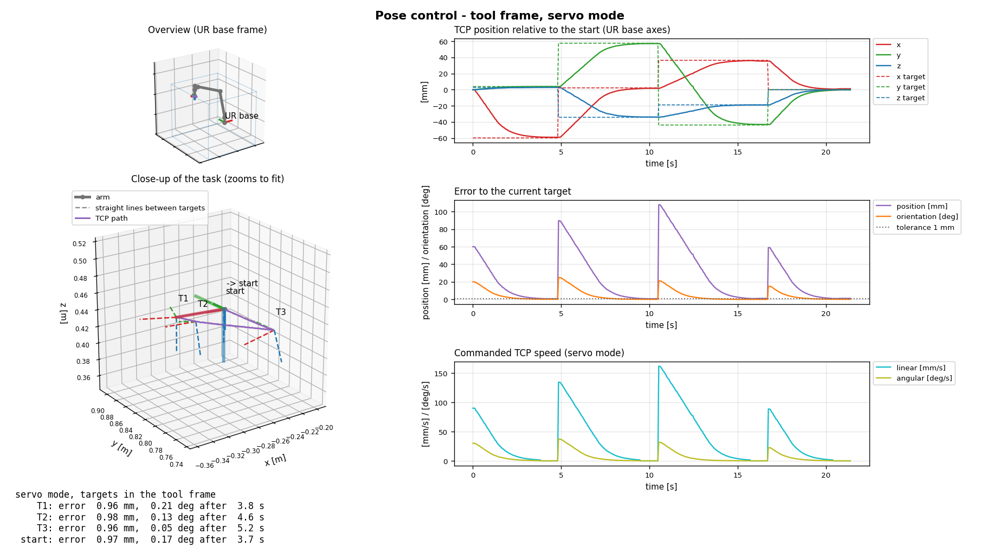
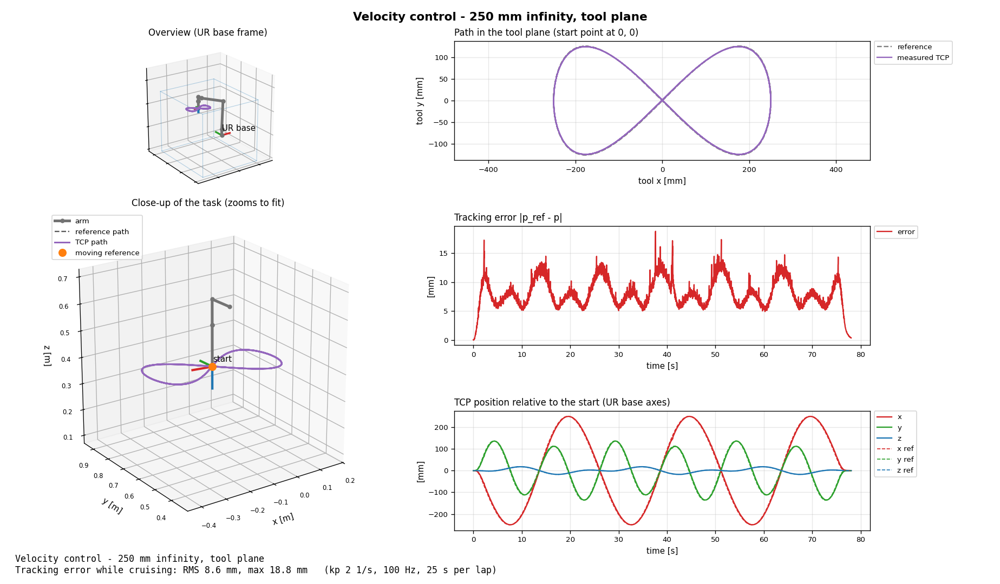
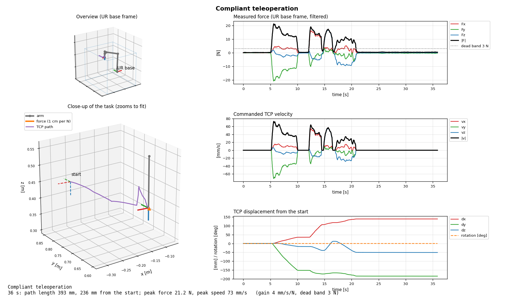
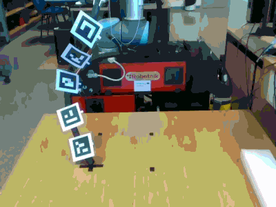
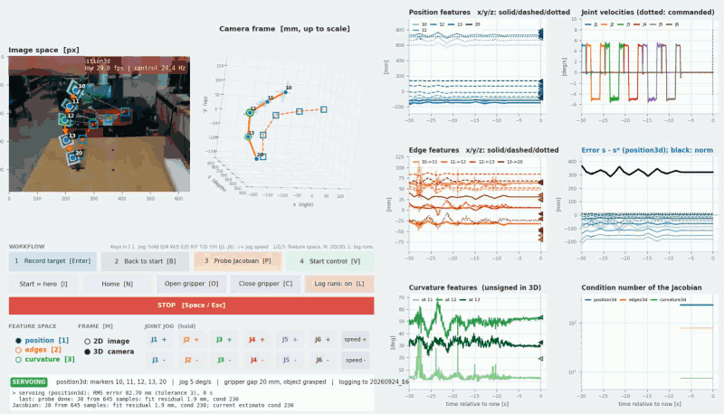

# Examples

Four control programs written with [`ur10api`](../docs/ur10api.md), from a simple
pose controller to model-free visual servoing. Each opens a live window, and
leaves a summary figure in `runs/` when it ends. The images below are real runs
on the Campero's UR10.

| # | Example | Control | Needs |
|---|---|---|---|
| 1 | [`01_pose_frames.py`](01_pose_frames.py) | TCP pose, P-controller on velocity | robot |
| 2 | [`02_velocity_path.py`](02_velocity_path.py) | TCP velocity along a path, feed-forward + feedback | robot |
| 3 | [`03_force_teleop.py`](03_force_teleop.py) | admittance: the arm follows your push | robot, FT 300 sensor |
| 4 | [`04_shape_servoing.py`](04_shape_servoing.py) | model-free shape servoing with ArUco markers | robot, RealSense D435/D415 |

## Before running any of them

1. Set up the environment once: `setup.bat` (Windows) or `./setup.sh` (Linux).
   See the [main README](../README.md#quick-start-windows-and-linux).
2. Start the robot side: bring-up, rosbridge, *Play* on the pendant
   ([robot-side start-up](../README.md#robot-side-start-up-campero-pc)).
3. Run from the repository root with the environment's Python:

   ```bash
   .venv\Scripts\python examples\01_pose_frames.py      # Windows
   .venv/bin/python examples/01_pose_frames.py          # Linux
   ```

   `--help` lists every option of an example.

What they all do:

- **Start-up check.** Wrist 3 wiggles by 1° a few times until commands reach
  the arm without delay (`--no-link-check` skips it).
- **Settings.** Defaults come from the `examples:` section of
  [`ur10_config.yaml`](../ur10_config.yaml) (example 4: from
  [`04_shape_servoing.yaml`](04_shape_servoing.yaml)). Command-line options
  override them.
- **Stopping.** Close the window or press `Ctrl+C`: the arm brakes, and the
  window becomes a summary saved as a PNG in `runs/`.
- **Safety.** The TCP stays inside the workspace box of `ur10_config.yaml`,
  and speeds are capped. Software STOP is not an emergency stop: keep the
  pendant's E-stop within reach.

---

## 1. Pose control toward target frames

```bash
python examples/01_pose_frames.py                                   # tool frame, servo mode
python examples/01_pose_frames.py --frame base --mode move          # base frame, one joint move per target
```

The TCP visits three target frames defined relative to its start pose, then
comes back. The targets are offsets of up to 6 cm and 20° (`targets` in
`ur10_config.yaml`), in the tool frame (default) or the base frame. In servo
mode a P-controller (`v = gain · error`) drives the TCP along straight lines.



**What to expect:** each target is reached within the 1 mm / 0.3° tolerance in
about 4–5 s. The error decays exponentially (middle plot), and the commanded
speed is highest right after each target switch (bottom). The summary lists the
final error and time per target. Start from a pose with about 10 cm of room
around the TCP.

## 2. Velocity control along a path

```bash
python examples/02_velocity_path.py                                          # settings of ur10_config.yaml
python examples/02_velocity_path.py --shape infinity --size 250 --period 25 --laps 3
python examples/02_velocity_path.py --shape circle --size 50 --plane base
```

The TCP follows a flat circle or infinity shape through its start point, in
the tool XY plane or the base XY plane. It uses feed-forward of the path
velocity plus feedback on the position error, and holds the orientation.



**What to expect:** with a 250 mm infinity at 25 s per lap (above), the tracking
error stays around 5–15 mm, with an RMS of 8.6 mm. It is larger where the path
curves most. Faster laps give more error: at 15 s per lap the TCP cuts the
corners by up to ~10 cm. The script refuses paths that leave the workspace, and
warns when the path needs more than `max_speed`.

## 3. Compliant teleoperation

```bash
python examples/03_force_teleop.py
python examples/03_force_teleop.py --rotate          # torques also turn the tool
```

Push the gripper and the arm follows: the force measured by the FT 300,
filtered and above a dead band (3 N), becomes a TCP velocity (4 mm/s per N).
**Do not touch the gripper until "Push the gripper" appears**: the sensor is
zeroed just before.



**What to expect:** nothing moves below the dead band (dotted line, top).
Pushes of 10–20 N move the TCP at 40–70 mm/s along the push, and releasing
brings it to rest in a fraction of a second. If the arm drifts on its own,
restart (the sensor zero is taken at start-up) or raise `--dead-band`. If it
moves against your push, use `--invert`.

## 4. Model-free shape servoing

```bash
python examples/04_shape_servoing.py                   # full workflow (robot + RealSense)
python examples/04_shape_servoing.py --frame camera    # start with 3D features
python examples/04_shape_servoing.py --camera-only     # no robot: camera, markers and features only
```

A RealSense camera watches ArUco markers (`DICT_4X4_50`) fixed along an object
held by the gripper, here a cable. The arm drives their shape to a recorded
target without any model of the camera, the arm or the cable. Everything is
driven from the window's buttons or keys:

| Step | Button [key] | What happens |
|---|---|---|
| 0 | *Open / Close gripper* [O] / [C] | grasp the object |
| 1 | jog buttons, or hold Q/A W/S E/D R/F T/G Y/H; then *Record target* [Enter] | move the joints until the shape is the one wanted, and store it |
| 2 | *Back to start* [B] | return to the configuration at start-up |
| 3 | *Probe Jacobian* [P] | each joint moves back and forth (±5° by default) while the markers are recorded; least squares gives the Jacobian J₀ |
| 4 | *Start control* [V] | damped-pseudoinverse servoing to the target, with a Broyden update of J |
| – | *STOP* [Space / Esc] | brake, at any time |

Switch the feature space (1 position, 2 edges, 3 curvature) and the frame
(M: 2D image or 3D camera frame) at any time, even while servoing.

What the camera sees during a run (position features in 3D, first 12 s):



The window during the same run:



- **Top left, image space:** markers, edges as arrows, and curvature as circles.
  The target is drawn in squares and dashes.
- **Next to it, in 3D:** the chain, the target and the recent trajectory of
  each marker in the camera frame.
- **Right:** the features over time, joint velocities, the error and its norm,
  and the condition number of J.

**What to expect:** probing takes about half a minute with the default ±5° and
5°/s, and reports the number of samples, the fit residual and cond(J₀). During
control the error norm (black) decays towards the dotted tolerance, and the
run ends by itself once the RMS error stays below it for a second. In the run
above the error norm fell from 320 mm to about 20 mm in 8–10 s, an RMS error of
about 5.6 mm per component against the 3 mm tolerance, and then held there
until the run was stopped by hand. The Broyden updates brought cond(J) from 230
down to about 30. If a marker is lost the arm holds still until it is back.

With *Log runs* on [L], each control run is also saved to
`runs/shape_servoing/<date>_<feature set>/`: `signals.csv`, `meta.json`, and
videos of the window and of the camera (the GIFs above come from them).

Tips: fix the markers with increasing IDs along the object, and list them in
`markers.ids` if other markers are in view. Probe near the configuration you
servo from. See the [full guide](../docs/ur10api.md#4-model-free-shape-servoing--examples04_shape_servoingpy)
for the feature definitions, the control law and every setting.
